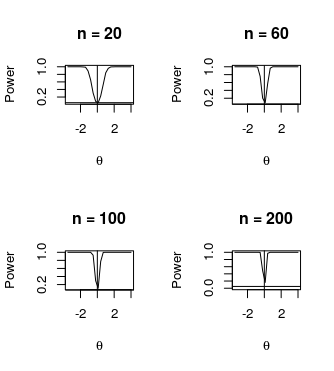

# Power-Wilcoxon-Test
On this test, we want to see the performance of the Wilcoxon test statistics subject to the sample size. Below we have the plots for different values of n = sample size. The hypothesis are: . We can see that the power increases as the n sample size increases

 ## Performance
 
 
